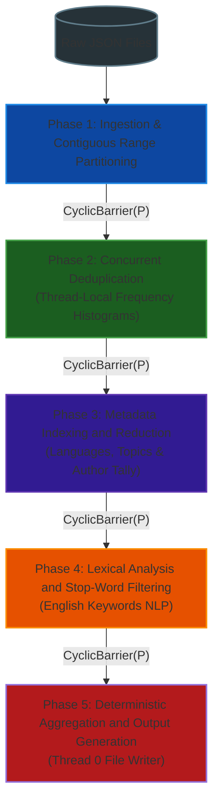
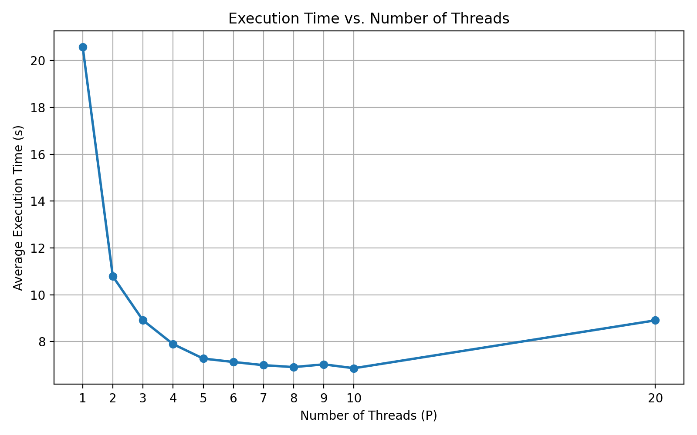
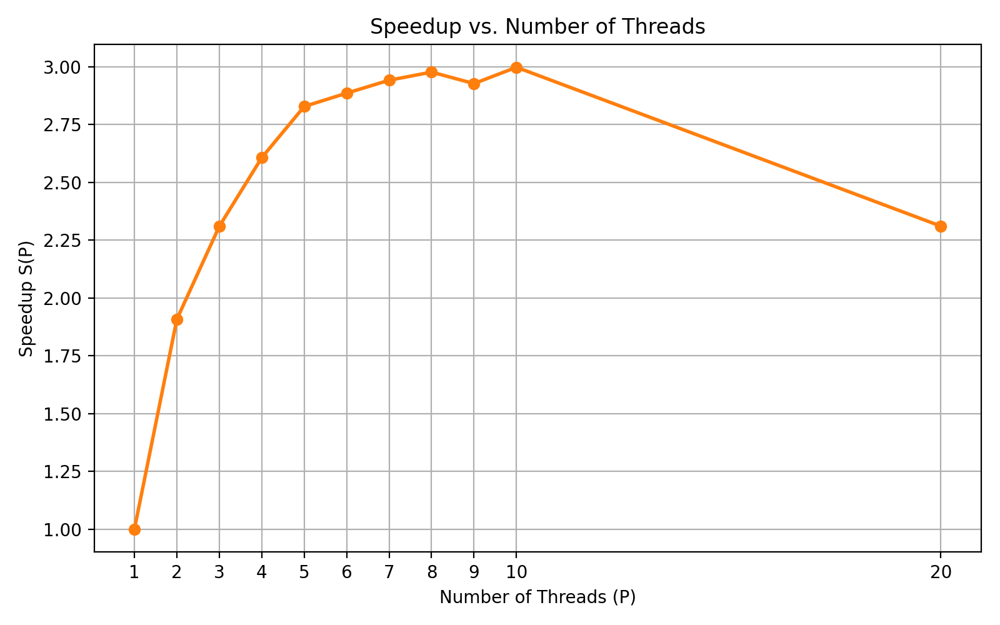
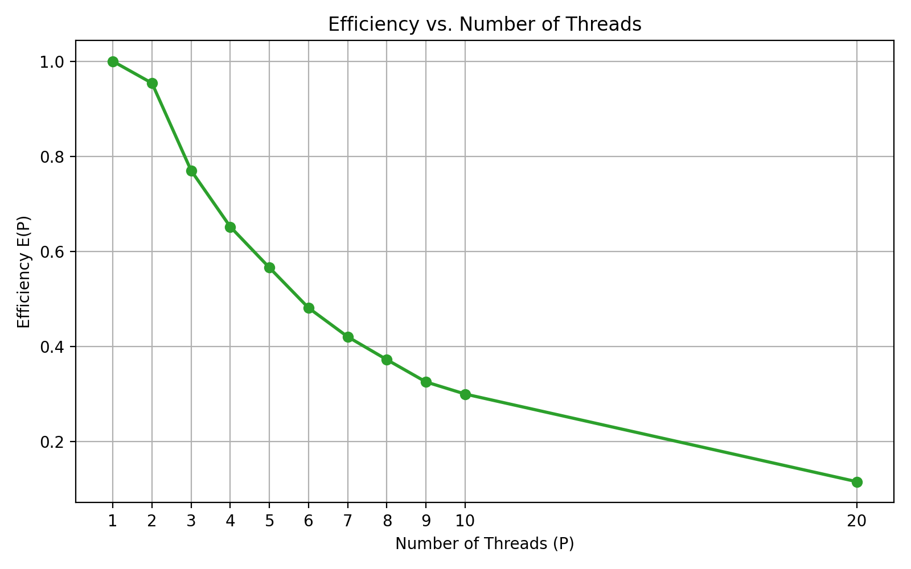

# Parallel News Aggregator & Stream Engine

An optimized multi-threaded data processing pipeline in Java designed to ingest high-volume, semi-structured news datasets (JSON), filter collisions and duplicates across multi-field attributes, build inverted indices across languages and categories, and extract lexical frequency trends under bounded memory constraints.

---

## Architecture Overview

The engine processes batch news feeds through a phased, synchronized pipeline. Rather than relying on unmanaged thread creation, the architecture enforces a fixed-size worker pool ($P$ threads) synchronized across computational milestones using reusable barrier primitives (`CyclicBarrier`).




## Detailed Pipeline Design

### 1. Workload Partitioning & Concurrency Model
* **Thread Model Selection:** Evaluated dynamic thread pooling (`ExecutorService`) against a dedicated fixed-thread execution model. A fixed pool was chosen to prevent thread creation churn, preserve CPU affinity, and enforce deterministic phase barriers (`CyclicBarrier(P)`).
* **Workload Division:** Worker threads calculate deterministic data slices based on worker ID and thread pool size:
  $$\text{start} = \left\lfloor \frac{\text{id} \cdot N}{P} \right\rfloor, \quad \text{end} = \min\left(\left\lfloor \frac{(\text{id} + 1) \cdot N}{P} \right\rfloor, N\right)$$
* **JSON Ingestion:** Ingests article arrays through Jackson's `ObjectMapper`, staging loaded records into a synchronized collector (`Collections.synchronizedList`) before signaling the first barrier.

### 2. Multi-Stage Deduplication Architecture
An article is considered duplicate if its `uuid` or `title` collides with another record. If a duplicate collision occurs, all instances are discarded.

* **Mitigating Shared Memory Bottlenecks:** A naive approach of streaming updates directly into global `ConcurrentHashMap` instances (`uuidFreq`, `titlesFreq`) via `.merge()` introduced high lock contention at the bucket level.
* **Two-Tier Aggregation:**
  1. **Thread-Local Accumulation:** Workers populate isolated instances (`localUuidFreq`, `localTitleFreq`) over their respective index partitions with zero lock overhead.
  2. **Barrier Synchronization:** Threads await local accumulation completion.
  3. **Atomic Reduction:** Workers merge local map tallies into the global frequency maps (`uuidFreq`, `titlesFreq`) using atomic sum merges.
  4. **Filtering Stage:** After a barrier, threads re-scan their segments and extract strictly non-colliding records ($\text{count} == 1$ on both keys) into `uniqueArticles`.

### 3. Metadata Indexing & Inverted Indices
Once unique records are isolated, threads process distinct slices $[\text{newStart}, \text{newEnd})$:
* **Thread-Local Inverted Indexes:** Threads maintain local maps to eliminate contention during extraction:
  * `localCatMap`: Category $\rightarrow$ List of Article UUIDs
  * `localLangMap`: Language $\rightarrow$ List of Article UUIDs
  * `localCategoryCount` & `localLanguageCount`: Occurrence counters
* **Validation Filtering:** Article properties are verified against $O(1)$ concurrent hash sets populated at startup (`validCategories`, `validLanguages`).
* **Parallel Global Reduction:** Thread-local maps are atomically folded into global registries (`mapCatIndices`, `mapLimbiIndices`, `mapCatCounts`, `mapLangCounts`).
* **Most Recent Article Tracking:** Each thread identifies a local candidate based on chronological timestamp (with lexicographical UUID tie-breaking). The global pointer is updated via a synchronized monitor lock (`Tema1.mostRecentArticleLock`) to guarantee consistency.

### 4. Text Processing & Lexical Analysis
* Targets articles identified as `language == "english"`.
* Normalizes text to lowercase, splits into tokens across whitespace boundaries, and purges non-alphabetic characters.
* Discards tokens matching `english_linking_words.txt`.
* Uses a per-article `HashSet` to ensure each keyword increments frequency only once per distinct document. Results are accumulated into the global `keywordCount` index.

### 5. Final Output Generation
After the final barrier sync, Worker Thread 0 handles deterministic disk output:
* Sorts and exports unique records to `all_articles.txt` in descending chronological order.
* Generates indexed UUID mappings per valid category and language.
* Exports ordered keyword occurrences to `keywords_count.txt` (frequency descending, lexicographical ascending).
* Compiles summary metrics to `reports.txt`.

---

## Performance & Scalability Analysis

### 1. Test Environment & Hardware Setup

Benchmarks were executed under WSL2 on an 8-core host machine:

| Component | Specification |
| :--- | :--- |
| **CPU** | AMD Ryzen 7 5800H (8 Physical Cores, 16 Threads, up to 4.4 GHz) |
| **Architecture** | x86_64 (2 Threads/Core, 1 Socket) |
| **RAM (WSL2)** | 7.4 GiB Total (6.5 GiB Free, 2.0 GiB Swap Unused) |
| **Host OS** | Windows 10 Home |
| **Guest OS / Kernel**| Ubuntu on WSL2 (Linux Kernel 6.6.87.2-microsoft-standard-WSL2) |
| **Java Runtime** | OpenJDK 11.0.29 (64-Bit Server VM, build 11.0.29+7) |

### Dataset & Scalability Benchmarks

The engine was benchmarked on multi-threaded workloads processing raw multilingual news corpora:
- **Sanity Datasets (`test_1` – `test_4`):** Functional correctness, language filtering, and edge cases.
- **Large-Scale Corpus (`test_5`):** **13,790 distinct JSON articles (~458 MB corpus)** processed concurrently across worker thread pools.
- **Source:** Derived from the Webhose / Webz.io Free News Dataset.
- **Benchmark Target:** Evaluated using the largest test fixture (`test_5`) to measure real-world I/O throughput, synchronization overhead, and thread contention over representative payloads.
---


### 2. Empirical Benchmark Results

Each thread count $P \in \{1, \dots, 10, 20\}$ was evaluated across 3 consecutive runs using `/usr/bin/time make run`. Wall-clock execution (`real` elapsed time) was averaged to compute Speedup $S(P) = \frac{T(1)}{T(P)}$ and Parallel Efficiency $E(P) = \frac{S(P)}{P}$:

| $P$ Threads | Run 1 (s) | Run 2 (s) | Run 3 (s) | Mean $T(P)$ (s) | Speedup $S(P)$ | Efficiency $E(P)$ |
| :---: | :---: | :---: | :---: | :---: | :---: | :---: |
| **1** | 22.412 | 22.376 | 16.969 | **20.586** | 1.000× | 1.000 |
| **2** | 10.717 | 10.554 | 11.098 | **10.790** | 1.907× | 0.953 |
| **3** | 8.741 | 8.780 | 9.212 | **8.911** | 2.310× | 0.770 |
| **4** | 7.865 | 7.910 | 7.913 | **7.896** | 2.607× | 0.651 |
| **5** | 7.089 | 7.528 | 7.217 | **7.278** | 2.828× | 0.565 |
| **6** | 7.158 | 7.005 | 7.235 | **7.133** | 2.886× | 0.481 |
| **7** | 6.939 | 7.092 | 6.960 | **6.997** | 2.942× | 0.420 |
| **8** | 6.893 | 6.864 | 6.986 | **6.914** | 2.977× | 0.372 |
| **9** | 6.934 | 6.979 | 7.182 | **7.032** | 2.927× | 0.325 |
| **10** | 6.878 | 6.878 | 6.842 | **6.866** | 2.998× | 0.299 |
| **20** | 9.581 | 8.596 | 8.550 | **8.909** | 2.310× | 0.115 |

---

### 3. Graphical Performance Evaluation

#### Execution Time Profile


#### Speedup Scaling


#### Parallel Efficiency Curve


---

### 4. Technical Analysis & Concurrency Insights

* **Scaling Phase ($P = 1 \to 2$):** Execution time drops from **20.58s** to **10.79s**, yielding an efficiency of **95.3%** and an almost ideal linear scaling factor ($1.91\times$). Aggregate CPU `user` time increases proportionally as two physical cores process JSON tokens in parallel.
* **Plateau & Amdahl's Law Limit ($P = 3 \to 8$):** As thread count approaches the machine's 8 physical cores, runtime drops to a minimum of **6.86s–6.91s**, plateauing at **~3.00×** speedup. Scaling is bounded in this region by Amdahl's Law: strictly sequential routines (initial argument parsing, master file index scanning, and Thread 0 output writes) become dominant contributors to runtime.
* **Degradation via Oversubscription ($P = 20$):** Exceeding the 16 virtual hardware threads causes elapsed time to degrade to **8.909s** ($S(20)$ drops back to $2.31\times$). This regression stems from:
  1. **Thread Context Switching:** The OS scheduler spends excessive CPU cycles swapping execution contexts on saturated cores.
  2. **Barrier Wait Stalls:** Thread arrival skew at each `CyclicBarrier` causes early-finishing threads to idle, waiting on preempted workers.
  3. **Bucket Contention:** Fine-grained locking overhead increases during concurrent reductions into `ConcurrentHashMap`.

**Optimal Configuration:** The engine achieves its ideal trade-off between throughput and hardware efficiency at **$P = 4 \text{ to } 8$ threads**, saturating CPU compute capacity without incurring oversubscription penalties.


## Build & Execution Instructions

### Prerequisites
* OpenJDK 21 or higher
* Apache Maven
* GNU Make

### Build
```bash
make build
```

### Execution
Run the aggregator through the build harness:
```bash
make run ARGS="<thread_count> <path_to_articles.txt> <path_to_inputs.txt>"
```

*Example:*
```bash
make run ARGS="4 ../checker/input/tests/test_small/articles.txt ../checker/input/tests/test_small/inputs.txt"
```

### Clean
```bash
make clean
```
